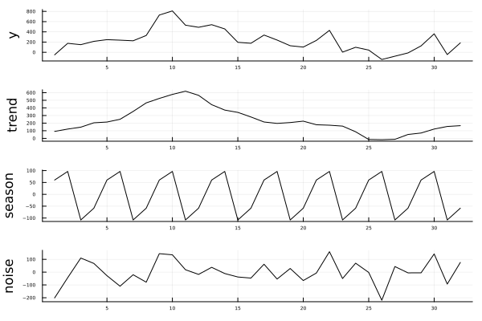

# How to add TrendDecomposition package

This package is now featured on the official general Julia package registry. 
Simply use Julia's package manager pkg to add TrendDecomposition to your preferred environment.

```Julia
@(v1.11) pkg> add TrendDecomposition

julia> using TrendDecomposition
```

The developing branch of this package can either be employed  by cloning this repository or by using the Julia package manager.
With the package manager simply use the add command:
```Julia
@(v1.11) pkg> add https://github.com/sdBrinkmann/TrendDecomposition.jl
```

For the developing branch one can alternatively try with add to fetch from the repository:
```Julia
@(v1.11) pkg> add https://github.com/sdBrinkmann/TrendDecomposition.jl
```

!!! warning 
	This package is currently under development and follows Semantic Versioning. Until the 1.0.0 release is reached,
	the API of this package can change with any minor version update, 
	please  consult the documentation of this package after each update when using this package.

# Usage

Below are serveral examples which demonstrate typical usecases of various functions contained in 
TrendDecomposition.jl. 

## Hodrick-Prescott Filter

The basic usage of trend estimation using the Hodrick-Prescott filter is demonstrated with the [US industrial production index (IPI)](https://fred.stlouisfed.org/series/IPB50001SQ) provided by FRED data service.

```Julia
using TrendDecomposition
using CSV

# Set path to directory where time series is located
path = "/.../data"

IPI = CSV.read("$(path)/IPB50001SQ.csv", copycols=true)

# HP filter with λ = 1600
hp = hpFilter(IPI[!, 2], 1600)

# The above is equivalent to Whittaker-Henderson smoothing with m = 2 differentiation
wh = bohlmannFilter(IPI[!, 2], 2, 1600)

# Boosted HP filter with baysian-type information criterion (BIC)
bHP_bic = bhpFilter(IPI[!, 2], 1600, Criterion="BIC")

# Boosted HP filter with augmented Dickey-Fuller (ADF) test 
bHP_adf = bhpFilter(IPI[!, 2], 1600, Criterion="ADF", p=0.01)
```


## Classical decomposition

This package implements moving averages with `rollingAverage` and seasonal averages with `maSeason`.
With the help of both functions, we can conduct time series decompositions into a trend, seasonal and
noise component. The function `maDecompose` replicates the decompose{stats} functionality implemented
in R.


``` Julia
using Plots
using TrendDecomposition

# Kendall M. G., Stuard A. (1983). The Advanced Theory of Statistics, Vol. 3
x = [-50, 175, 149, 214, 247, 237, 225, 329, 729, 809,
       530, 489, 540, 457, 195, 176, 337, 239, 128, 102, 232, 429, 3,
     98, 43, -141, -77, -13, 125, 361, -45, 184]


res = maDecompose(x, 4, combine=true)

plot(res; layout = (4, 1), title=["y" "trend" "season" "noise"], legend=false, tickfontsize=4)

```




##  Holt-Winters Method

For both local trend and seasonal component estimation, the Holt-Winters method can be used. The two following
examples illustrate its dual usecase of modeling a trend and seasonal component for both decomposition and for forecasting time series.


### Decomposition
``` Julia
using Plots
using CSV
using DataFrames

using TrendDecomposition

# Box, G.E.P., Jenkins, G.M. and Reinsel, G.C. (1994) Time Series Analysis; Forecasting and Control. 3rd Edition
air = CSV.read("./AirPassengers.csv", DataFrame, copycols=true)
data = air[!, 2]

seasons = 12

# Decomposition using multiplicative model with automatic optimization
f1, D1, p1 = holtWinters(data, seasons, model=:mul)

# difference between data points and estimated values
residual = data .- f1

plot([data D1 residual], layout = (5, 1), ylabel = ["y" "level" "slope" "season" "residual"], legend=false, tickfontsize=4, color=:black, guidefontsize=8)

```


### Forecasting

The damping factor ``\varphi`` can be typed in julia with the keyboard as follows: \varphi`<tab>`
``` Julia

# Forecast horizon h = 24 and damping factor \varphi = 1
f2, D2, p2 = holtWinters(data, seasons, h=24, model=:mul, φ = 1)

n = length(data)
steps = (n+1):(n+24)

plot(data, color=:black, legend=false, title="HW forecast h=24")
plot!(steps, f2[(end-23):end], color=:red, label="forecast")
```


## Taut String

Taut string is a efficient ``O(n)`` algorithm for total variation regularization.

``` Julia
# Data from: Donoho, D. L. et al (1995) Wavelet Shrinkage: Asymptopia? Journal of the Royal Statistical Society series B, 57, 301–337. 

string, (x, y) = tautStringFit(djblocks, 10)

# (x, y) are coordiantes of knots

plot(djblocks, label="y")
plot!(string, label="string")

```


